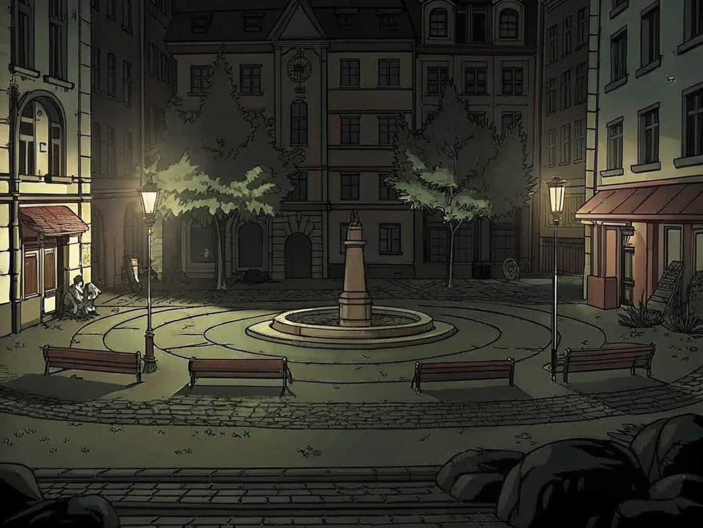

# La Place des Artistes

## Description Générale
Une place pavée circulaire entourée de vieux bâtiments, point de rencontre traditionnel des artistes de rue de la Cité. L'endroit vibre d'énergie créative, mais depuis les récentes disparitions, une tension sous-jacente est palpable.

## Atmosphère
- Animation constante pendant la journée
- Mélanges de musiques et de performances
- Parfums de nourriture de rue
- Ambiance plus tendue depuis les disparitions

## Zones Notables

### Le Cercle Central
- Grande fontaine art déco
- Espace de performance principal
- Bancs en pierre disposés en cercle
- L'ancien spot favori de Thomas Chen

### Les Arcades
- Abri pour les artistes
- Petites boutiques d'art
- Cafés et échoppes
- Acoustique particulière

### Le Coin des Peintres
- Chevalets permanents
- Mur d'expression libre
- Vue sur la [Galerie des Murmures](galerie_des_murmures.md)
- Étal de fournitures d'art

## Personnages Réguliers
- [Le Gardien du Parc](../npcs/le_gardien_du_parc.md) - Présence mystérieuse et protectrice
- [Marcus le Jongleur](../npcs/marcus_le_jongleur.md) y performe régulièrement
- [Mei Wong](../npcs/mei_wong.md) - Capture la vie de la place en photos
- Vendeurs ambulants qui connaissent tous les ragots
- Artistes de rue inquiets
- Touristes et passants

## Points d'Intérêt pour l'Enquête
- Témoins des changements de comportement des victimes
- Rumeurs sur la galerie
- Photos et vidéos des performances passées
- Traces d'autres disparitions

## Activités
- Performances improvisées
- Échanges d'informations
- Vente d'art de rue
- Réunions informelles d'artistes

## Secrets
- Réseau souterrain d'information entre artistes
- Certains artistes ont des pouvoirs latents
- La fontaine cache des messages
- Les pigeons semblent observer les gens

## Notes pour le MJ
- Excellent lieu pour obtenir des informations
- L'ambiance change selon l'heure
- Point d'observation des activités de la galerie
- Les artistes peuvent être des alliés ou des antagonistes
