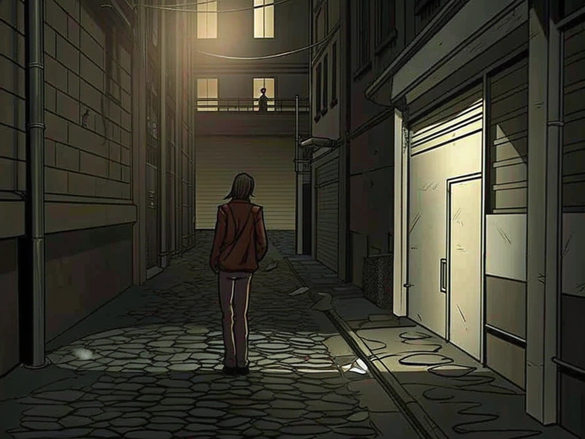

# La Ruelle du Violon

## Description Générale
Une étroite ruelle pavée entre la [Galerie des Murmures](galerie_des_murmures.md) et un vieil immeuble d'appartements. L'endroit où le violon de Thomas Chen a été retrouvé est maintenant un lieu de pèlerinage pour les artistes de rue.

## Atmosphère
- Toujours légèrement brumeuse
- Écho étrange des sons de la ville
- Odeur persistante de pluie même par temps sec
- Sensation d'être observé

## Éléments Notables

### Le Coin du Violoniste
- Marque au sol où le violon a été trouvé
- Petits mémoriaux laissés par d'autres artistes
- Graffiti mystérieux d'une femme dansante
- Réverbère qui clignote de façon rythmique

### Les Murs
- Vieux graffitis qui semblent changer
- Affiches délavées d'anciens spectacles
- Tuyauterie apparente qui "chante" quand il y a du vent
- Portes condamnées menant nulle part

### L'Accès à la Galerie
- Porte de service verrouillée
- Fenêtres du sous-sol
- Grille d'aération émettant des sons étranges
- Caméras de surveillance (non fonctionnelles)

## Points d'Intérêt pour l'Enquête
- Traces de pas qui disparaissent mystérieusement
- Échos de musique à certaines heures
- Marques de griffures sur les murs
- Objets perdus par d'autres victimes

## Phénomènes Étranges
- Les ombres bougent indépendamment de leur source
- Les sons résonnent plus longtemps que normal
- Les graffitis changent quand on ne les regarde pas
- Le temps semble parfois se distordre

## Indices Cachés
- Fragments de partition dans les flaques d'eau
- Empreintes digitales sur le réverbère
- Traces de poudre brillante près des grilles
- Échos de conversations passées

## Notes pour le MJ
- Les indices changent selon l'heure de la journée
- Le lieu devient plus dangereux la nuit
- Les PJ peuvent y rencontrer d'autres enquêteurs
- Point d'accès potentiel aux passages secrets de la galerie
