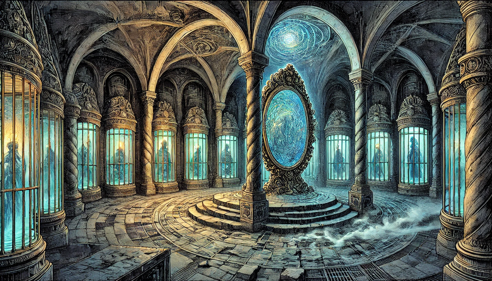

# Les Tunnels de la Muse

## Description Générale
Un réseau de tunnels secrets sous la [Galerie des Murmures](galerie_des_murmures.md), où [Madame Echo](../npcs/madame_echo.md) conserve sa véritable "collection". Ces passages labyrinthiques sont imprégnés de magie ancienne et résonnent de mélodies fantomatiques.

## Atmosphère
- Brume permanente au sol
- Échos musicaux distants
- Air chargé d'énergie mystique
- Température anormalement basse

## Zones Principales

### La Salle des Miroirs
- Miroirs anciens de toutes tailles
- Reflets montrant les artistes piégés
- Centre du pouvoir de Madame Echo
- Portails vers des dimensions artistiques

### Les Galeries des Murmures
- Cellules cristallines contenant les artistes
- Murs couverts de partitions vivantes
- Sculptures qui bougent
- Tableaux qui changent constamment

### Le Théâtre Souterrain
- Scène circulaire antique
- Sièges vides qui semblent occupés
- Orchestre fantôme
- Lieu des "performances spéciales"

### Les Passages Secrets
- Entrées dissimulées dans la galerie
- Connexions avec d'autres lieux artistiques
- Pièges mystiques
- Échos du passé

## Dangers
- Pièges magiques
- Illusions désorientantes
- Échos qui peuvent rendre fou
- Gardiens artistiques corrompus

## Secrets
- Source du pouvoir de Madame Echo
- Prison des artistes disparus
- Connexions avec d'autres Rifts
- Archives d'art volé

## Points d'Intérêt pour l'Enquête
- Preuves des disparitions
- Journal secret de [Gabriel Vale](../npcs/gabriel_vale.md)
- Artefacts mystiques
- Thomas Chen et les autres victimes

## Notes pour le MJ
- Lieu pour la confrontation finale
- Les tunnels réagissent aux émotions
- La disposition change constamment
- Les PJ peuvent libérer les artistes prisonniers
