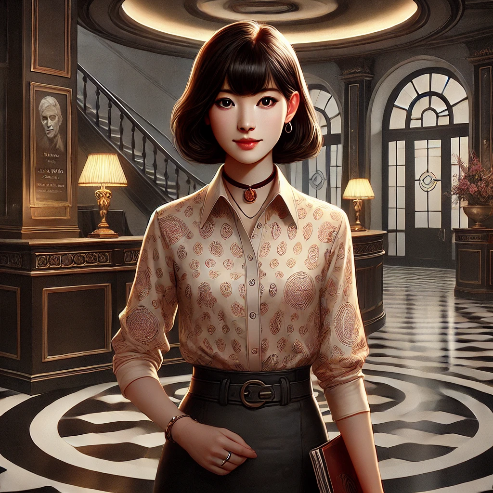

# Lisa Ming

## Identité Mondaine
- **Nom** : Lisa Ming
- **Occupation** : Réceptionniste à la [Galerie des Murmures](../locations/galerie_des_murmures.md)
- **Apparence** : Jeune femme d'origine asiatique, style vestimentaire professionnel mais artistique
- **Comportement** : Amicale, serviable, légèrement anxieuse

## Caractéristiques
- Étudiante en histoire de l'art
- Observatrice attentive
- Intuition développée
- Commence à avoir des soupçons

## Rôle dans l'Histoire
- Témoin involontaire
- Potentielle alliée pour les PJ
- Source d'information sur les visiteurs
- Pourrait devenir une future victime

## Ce qu'elle sait
- Les horaires de visite des artistes disparus
- Les changements d'humeur de [Madame Echo](madame_echo.md)
- Les allées et venues suspectes
- L'existence de réunions nocturnes mystérieuses

## Ce qu'elle ignore
- La véritable nature de sa patronne
- Le sort des artistes disparus
- L'implication de [Gabriel Vale](gabriel_vale.md)

## Relations
- [Madame Echo](madame_echo.md) - Sa patronne qu'elle admire et craint
- [Gabriel Vale](gabriel_vale.md) - Le trouve inquiétant
- Les visiteurs réguliers - Développe des relations amicales

## Notes pour le MJ
- Peut devenir une informatrice précieuse
- Sa curiosité pourrait la mettre en danger
- Possède un journal où elle note ses observations
- A remarqué des détails importants sans en comprendre la signification
