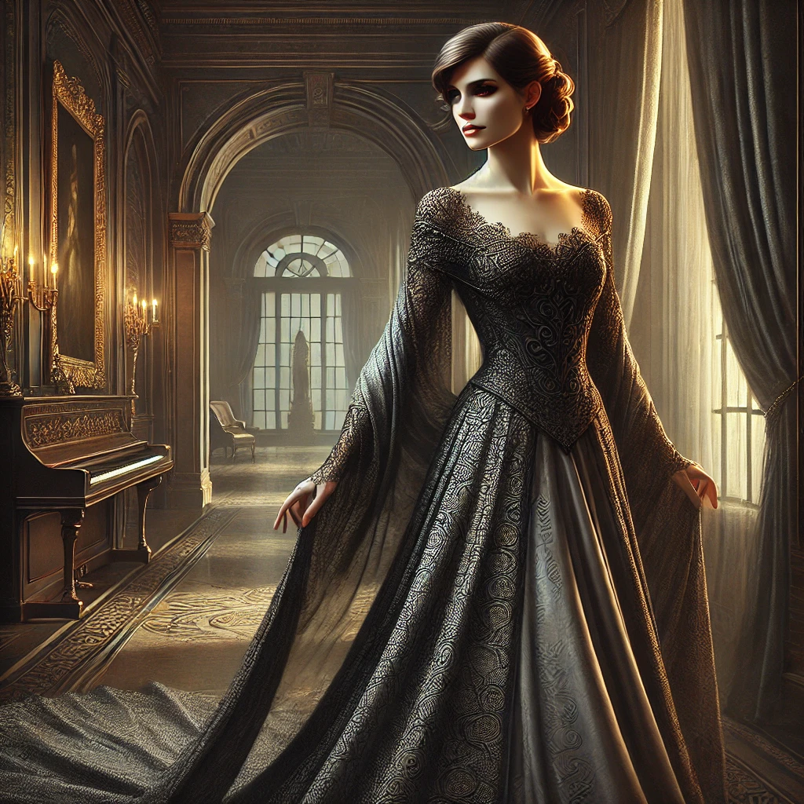

# Madame Echo

## Identité Mondaine
- **Nom** : Victoria Echo
- **Occupation** : Propriétaire de la [Galerie des Murmures](../locations/galerie_des_murmures.md)
- **Apparence** : Une femme élégante d'âge indéterminé, toujours vêtue de noir et de gris
- **Comportement** : Gracieuse, séduisante, mais avec une froideur calculée

## Rift
- **Mythes** : Terpsichore (Muse de la Danse)
- **Thèmes** :
  - Inspiration (Corrompu)
  - Mouvement
  - Manipulation
  - Art

## Motivations
- Absorber l'inspiration créative des artistes pour maintenir son immortalité
- Créer une collection "parfaite" d'art vivant
- Retrouver sa gloire d'antan en tant que muse

## Pouvoirs
- **Danse des Ombres** : Peut se déplacer à travers les ombres
- **Mélodie Envoûtante** : Sa voix peut hypnotiser les artistes
- **Vol d'Inspiration** : Capable d'absorber le talent créatif
- **Miroirs Vivants** : Peut apparaître dans n'importe quel reflet de la galerie

## Faiblesses
- Doit constamment absorber de nouvelle inspiration
- Ne peut pas créer d'art elle-même
- Obsédée par la "perfection" artistique
- Vulnérable à l'art véritablement spontané et chaotique

## Relations
- [Gabriel Vale](gabriel_vale.md) - Son conservateur dévoué et premier "collectionné"
- [Lisa Ming](lisa_ming.md) - Sa réceptionniste, ignorante de sa vraie nature
- Thomas Chen - Sa dernière "acquisition"

## Notes pour le MJ
- Elle apparaît toujours au moment le plus dramatique
- Parle souvent par métaphores liées à l'art et à la danse
- Peut être une alliée temporaire si les PJ l'impressionnent avec leur créativité
- Ne se bat jamais directement, préfère manipuler les autres
