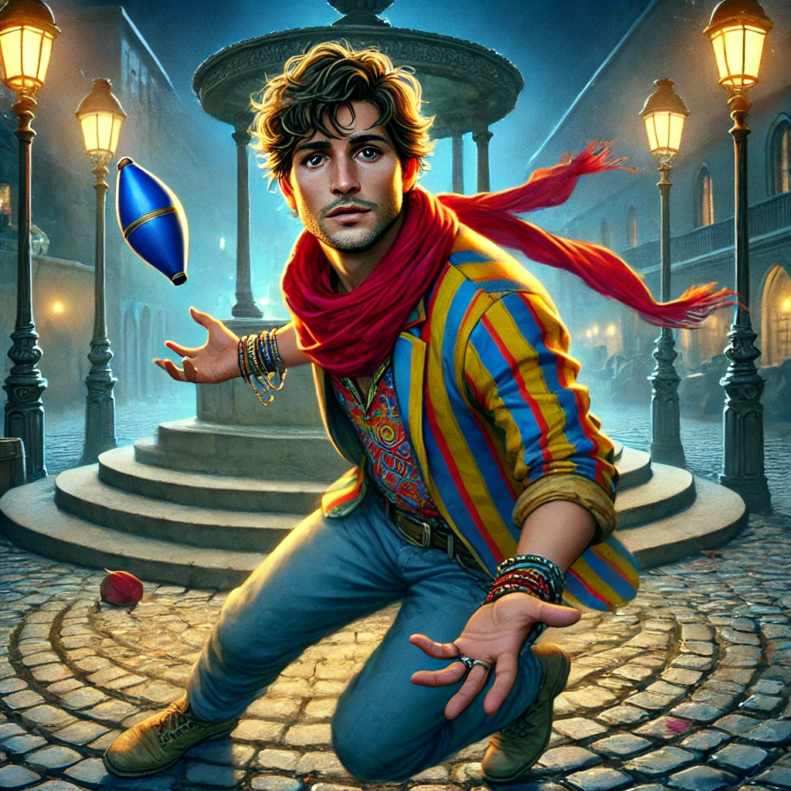

# Marcus le Jongleur

## Identité Mondaine
- **Nom** : Marcus "Le Jongleur" Rodriguez
- **Occupation** : Artiste de rue, jongleur
- **Apparence** : Homme de 35 ans, cheveux en bataille, vêtements colorés, toujours en mouvement
- **Comportement** : Nerveux, bavard, observateur

## Caractéristiques
- Connaît tous les artistes de rue
- Excellent sens de l'observation
- Tendance à parler par métaphores
- Intuition développée pour le danger

## Rôle dans l'Histoire
- Témoin clé
- Source d'information sur la communauté des artistes
- Peut alerter les PJ sur d'autres disparitions
- Connection entre différents éléments de l'enquête

## Ce qu'il sait
- Les changements de comportement de Thomas
- D'autres artistes qui ont visité la [Galerie des Murmures](../locations/galerie_des_murmures.md)
- Des rumeurs sur des "performances spéciales" à la galerie
- L'existence d'une "aura étrange" autour de certaines personnes

## Ce qu'il a vu
- Thomas entrant dans la galerie la nuit de sa disparition
- [Madame Echo](madame_echo.md) observant les artistes de rue
- Des ombres dansantes dans les fenêtres de la galerie
- D'autres artistes devenant "différents" après avoir visité la galerie

## Relations
- Thomas Chen - Ami et collègue artiste de rue
- [Sarah Chen](sarah_chen.md) - La connaît via Thomas
- Les autres artistes de rue - Source d'information
- [Lisa Ming](lisa_ming.md) - Flirte occasionnellement avec elle

## Notes pour le MJ
- Peut servir de système d'alerte précoce pour les PJ
- Ses observations apparemment décousues cachent des vérités importantes
- A peur d'entrer dans la galerie
- Pourrait disparaître s'il en découvre trop
